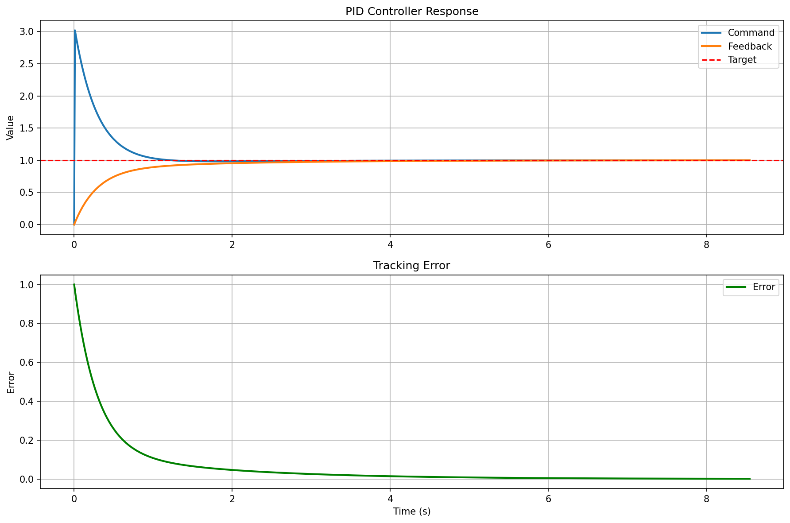

# PID Control Platform

Платформа для автоматической генерации C-кода PID-регуляторов из XML-моделей Simulink и их верификации.

## Структура проекта

| Директория | Описание |
|------------|----------|
| `dsl/` | DSL генератор: парсит XML, генерирует C-код |
| `simulation/` | Симулятор: тестирует сгенерированный регулятор |

